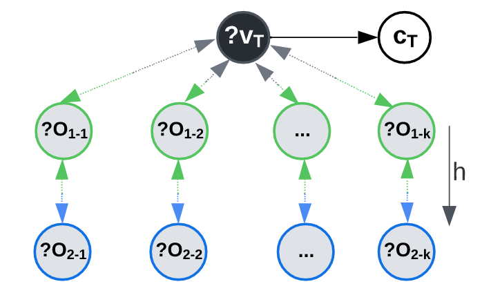

# KG-TOSA: A Task-Oriented graph SAmpler for GNN
<figure>
  
  <figcaption>Fig.1: The TOSG’s generic graph pattern is based on two parameters: (i) the direction (outgoing and incoming) predicates, and (i) the number of hops.</figcaption>
</figure>

## Installation
* Clone the `KGTOSA` repo 
* Create `KGTOSA` Conda environment (Python 3.8) and install pip requirements.
* Activate the `KGTOSA` environment
```commandline
conda activate KGTOSA
```


<b>Extract TOSG triples:</b>
1. Node Classification
```python
python -u TOSG_Extraction_NC.py --sparql_endpoint http://206.12.98.118:8890/sparql --graph_uri http://dblp.org --target_rel_uri https://dblp.org/rdf/schema#publishedIn --TOSG d1h1 --batch_size 1000000 --out_file dblp_pv --threads_count 32  
```
2. Link Prediction
```python
python -u TOSG_Extraction_LP.py --sparql_endpoint http://206.12.98.118:8890/sparql --graph_uri http://dblp.org --target_rel_uri https://dblp.org/rdf/schema#AffaliatedWith --TOSG d2h1 --batch_size 1000000 --out_file dblp_AA --threads_count 32  
```

<b>Reproduce KGTOSA Results:</b>
1. Node Classification
```python
# run RGCN  
python rgcn-KGTOSA.py --Dataset <DatasetPath>
# run GraphSaint  
python graph_saint_KGTOSA.py --Dataset <DatasetPath>
# run ShaDowSaint  
python graph_saint_Shadow_KGTOSA.py --Dataset <DatasetPath>
# run SeHGNN  
python SeHGNN/ogbn/main.py --Dataset <DatasetPath>
# run IBS
python  IBS/run_ogbn_ppr.py --with config/<Config_path>  

```

2. Link Prediction <br>
extract the dataset folder under the data folder under each method path
```python
# run RGCN  
python RGCN/main.py --Dataset <DatasetName> --TargetRel <target_rel>
# run MorsE  
python Morse/main.py --dataset <DatasetName> --TargetRel <target_rel
# run LHGNN  
python LHGNN/main.py --dataset <DatasetName> --TargetRel <target_rel
```

<p> KGTOSA datasets download Linls </p>
<p><a href="http://206.12.94.177/CodsData/KGNET/KGBen/MAG/MAG42M_PV_FG.zip">MAG_42M_FG</a>
<a href="http://206.12.94.177/CodsData/KGNET/KGBen/MAG/MAG42M_PV_d1h1.zip">MAG_42M_d1h1</a>
<a href="http://206.12.94.177/CodsData/KGNET/KGBen/DBLP/DBLP15M_PV_FG.zip">DBLP-15M_d1h1</a>
<a href="http://206.12.94.177/CodsData/KGNET/KGBen/DBLP/DBLP15M_PV_d1h1.zip">DBLP-15M__d1h1</a></p>
