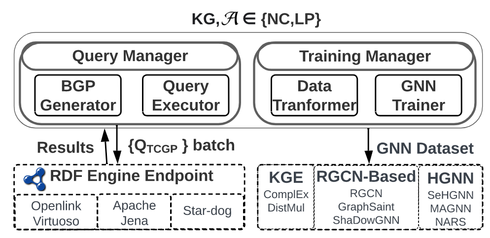

# KG-TOSA: A META-SAMPLER FOR GNN
<figure>
  
  <figcaption>Fig.1: KG-TOSA System Architecture is composed of two
main components. The GNN meta-sampler component extracts the task-relevant 𝐾𝐺′ as a set of triples using SPARQL
BGPs. The Hetero-GNN dataset transformer component
transforms the raw triples into the GNN-enabled dataset
format to apply the GNN training.</figcaption>
</figure>

 KGTOSA SPARQL Variations

<ul> 
<li>Star-Query Meta-Sampler</li>
<li>Bi-directional Star-Query Meta-Sampler</li>
<li>Path-Query Meta-Sampler</li>
<li>Bi-directional Path-Query Meta-Sampler</li>
</ul>
